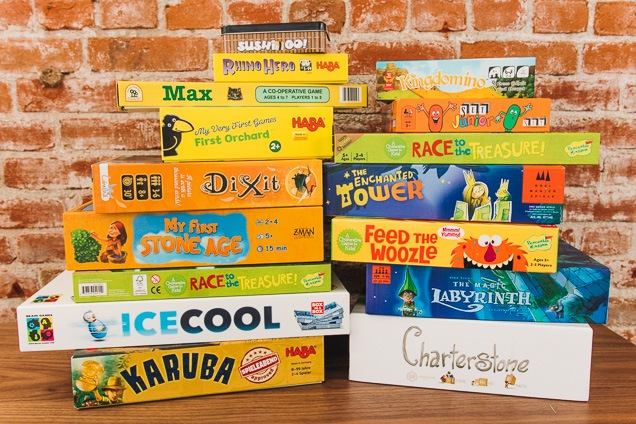

# Board Games

Free opensource portal that allows you to play most of the board games online.

Currently supported games:
* Test (in progress)
* Munchkin (in progress)

# Demo

[https://boaga.herokuapp.com/](https://boaga.herokuapp.com/)  
Powered by [Heroku](https://www.heroku.com/)

# Technical stack

* Angular CLI ([https://cli.angular.io/](https://cli.angular.io/))
* NestJS ([https://nestjs.com/](https://nestjs.com/))
* Angular Material ([https://material.angular.io/](https://material.angular.io/))
* @ngrx store ([https://github.com/ngrx/store](https://github.com/ngrx/store))
* @ngx-translate localization ([https://github.com/ngx-translate](https://github.com/ngx-translate))

# Monitoring

* Rollbar ([https://rollbar.com/](https://rollbar.com/))
* Google analytics ([https://analytics.google.com/analytics/web/](https://analytics.google.com/analytics/web/))

# License

[MIT](LICENSE)
